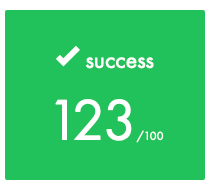

# Libft
This project is going to help you consolidate your piscine experience. You are going to re-code several functions of the standard C library, as well as other utility functions that you will use often during your training.



This was the first project after Piscine Reloaded. It is a **static library** which contains a reimplementation of *some* of the C standard library functions, plus some extra to deal with **linked lists**.

> This is the **historic** version of the repo, meaning the stuff I submitted and got evaluated. I keep a [live version here](https://github.com/lifeBalance/libft_live).

## Testing the libray
It includes a small test suite that I wrote myself at the same time I was developing the library, in order to test basic functionality. That means it doesn't contains lots of twisted test; but it was enough to help me pass the moulinette so. Just use the `-D` option to define macros at compilation time:
```
cd eval_tests
make -C ../
gcc -D FT_PUTCHAR_FD -x c main.c.test -I.. -L.. -lft
```

### TODO
List of things to improve:

* In `ft_strplit.c`, in case the allocation of a string fails, it's convenient to add a function that iterate over the partially created array of string and deletes them all.
